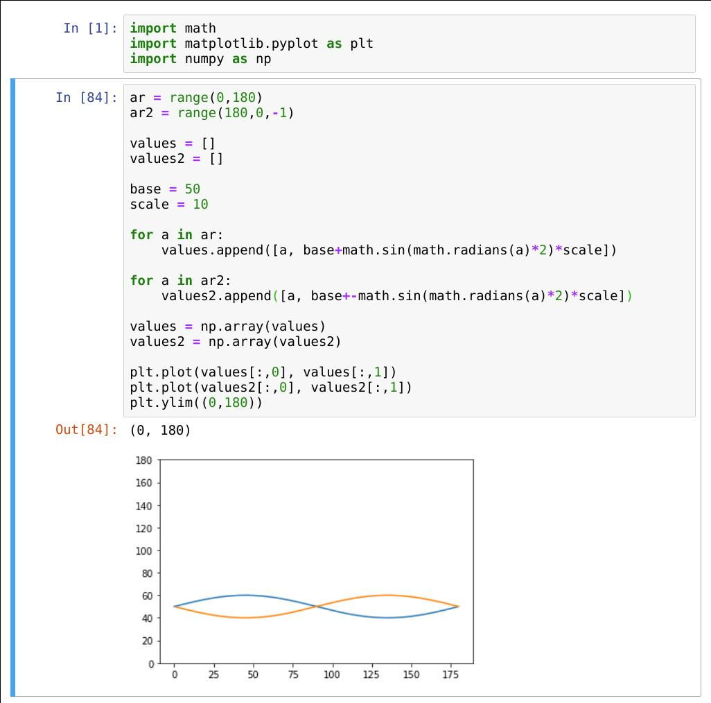

# cats_and_lasers
Code and schematics for the laserturret cat-toy as described at [my blog](http://www.tobias-weis.de/cats-and-lasers/) 

## Final device

## Hardware used
* AZDelivery NodeMCU Lua Amica Modul V2
* DAGU pan/tilt servo kit https://robosavvy.com/store/dagu-pan-tilt-kit-with-servos.html
* Some male and female pinheaders
* A blank 7cmx10cm PCB that I milled in a CNC

## Software used
* Arduino IDE and several ESP2866-libraries to compile for the NodeMCU
* HTML/Javascript/JQuery/Bootstrap to create the website-frontend
* Eagle to design the schematic and the (pcb) board-layout
* Chillipeppr/Jpadie workspace to create G-Code for the mill
* Python/jupyter to simulate the servo-movements

## Calculating the servo-sweeps
I created the jupyter-notebook ServoSweepCalculator.ipynb located in the other_scripts folder

